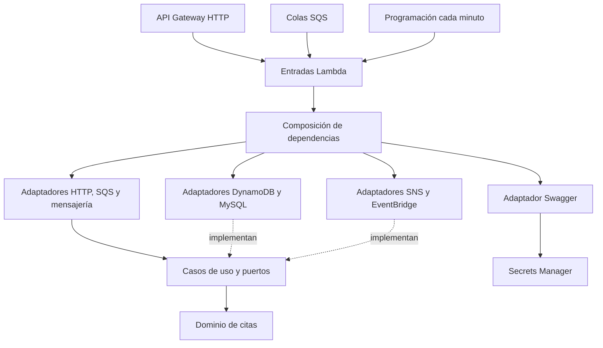

# Arquitectura y responsabilidades

La aplicación sigue arquitectura hexagonal: los casos de uso dependen de puertos y del dominio; los adaptadores implementan la comunicación con AWS y las bases de datos. La composición conecta esas piezas y las entradas Lambda delegan la ejecución.

El gráfico representa responsabilidades y dependencias; los diagramas de [flujos](flujos.md) muestran la ejecución temporal.

| Directorio           | Responsabilidad                                                        |
| -------------------- | ---------------------------------------------------------------------- |
| `src/domain`         | Entidades, tipos e identidad estable de las citas                      |
| `src/application`    | Casos de uso, DTO y puertos; sin clientes AWS                          |
| `src/infrastructure` | Adaptadores, validación de entradas, persistencia y documentación HTTP |
| `src/composition`    | Construcción de clientes, repositorios, casos de uso y logs            |
| `src/handlers`       | Entradas Lambda y contexto de ejecución                                |
| `infra`              | Definición del despliegue, roles, monitoreo y recursos                 |
| `scripts`            | Compilación, empaquetado, comprobaciones y operación                   |
| `tests`              | Comportamiento unitario e integración real local                       |

`scripts/check-boundaries.ts` comprueba las importaciones entre capas y los ciclos. Swagger es una capacidad de infraestructura HTTP; no introduce autenticación ni dependencias de documentación en los casos de uso de citas.

## Datos e idempotencia

DynamoDB conserva las citas, las claves de idempotencia y el outbox. La transacción de registro mantiene juntas la aceptación y la intención de publicar. El identificador de cita es estable para la misma combinación de asegurado, horario y país. La clave opcional `Idempotency-Key` dura 24 horas y detecta reutilización con otra entrada.

Los workers PE y CL escriben en sus bases MySQL mediante Aurora Data API. La persistencia por país y su confirmación pendiente se guardan transaccionalmente. La publicación y el consumo pueden repetirse: los repositorios y las confirmaciones admiten duplicados sin crear una nueva cita.

## Contratos y límites

Los esquemas Zod de `src/infrastructure/shared/appointment.schema.ts` validan entradas y alimentan OpenAPI. `src/infrastructure/http/swagger/openapi.ts` añade operaciones, respuestas y ejemplos. El script de exportación y el empaquetado utilizan el mismo generador.

Cada Lambda tiene un paquete y un rol propio. La Lambda de Swagger solo puede escribir sus logs y leer su secreto. Sus recursos web son locales, salen de un manifiesto cerrado y no requieren una CDN ni un validador externo. El empaquetado rechaza archivos inesperados, rutas ajenas al manifiesto y tamaños excesivos.
