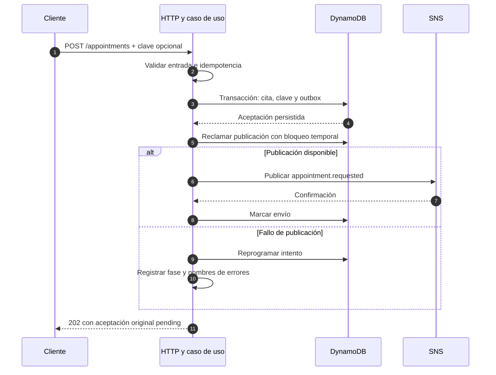
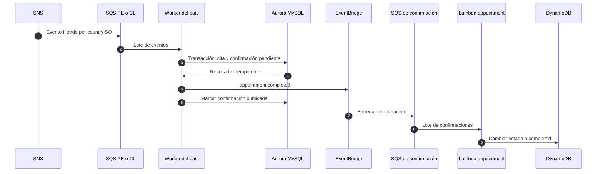
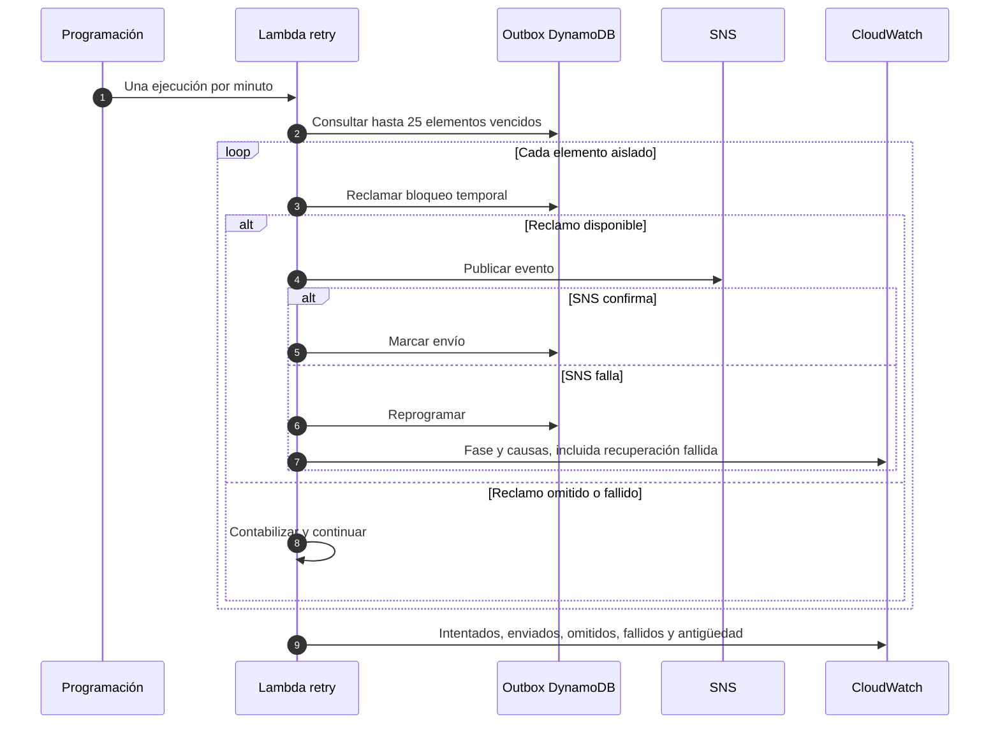
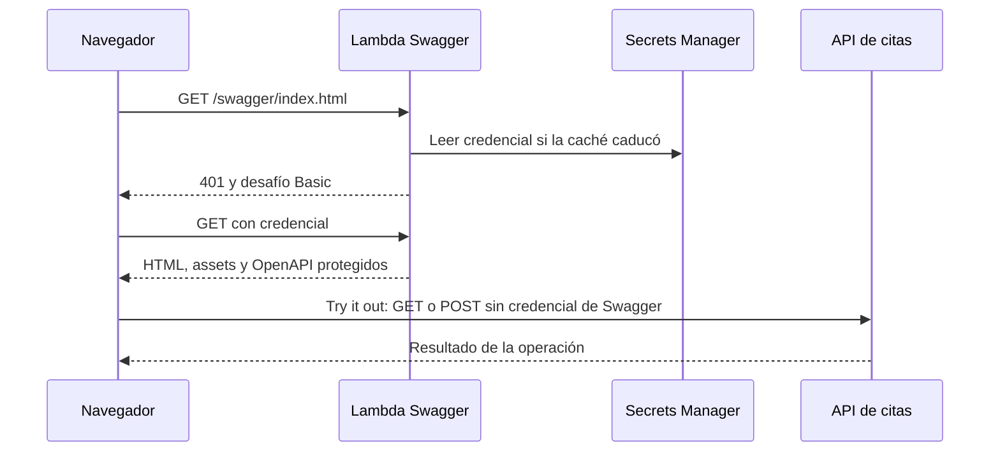

# Flujos de ejecución

## Registro y aceptación durable

Un fallo anterior al commit no confirma aceptación. Una vez persistida la transacción, un fallo de publicación no cambia el `202`. Si SNS aceptó el evento y falla marcar el envío, se conserva el bloqueo hasta que venza: una repetición posterior es segura por idempotencia.

## Procesamiento por país y confirmación

Si EventBridge falla después del commit SQL, el reintento reutiliza la confirmación persistida. Cada consumidor devuelve únicamente los identificadores de mensajes fallidos mediante `ReportBatchItemFailures`; las colas y DLQ mantienen la recuperación de entregas.

## Recuperación del outbox

Las cancelaciones transaccionales de DynamoDB se clasifican antes de reintentar: conflictos y condiciones de concurrencia pueden recuperarse; los errores permanentes de validación o tamaño fallan inmediatamente. Sin razones detalladas se conserva el máximo de ocho intentos.

## Consulta y documentación

GET valida el asegurado y el tamaño de página. El cursor debe ser base64url canónico, contener JSON válido y un UUID válido, y corresponder al mismo asegurado. Un cursor inválido devuelve `400 INVALID_CURSOR`.

Los errores de validación incluyen `error.details`, una lista de campos con mensajes que explican la regla incumplida. Un cuerpo con varios campos incorrectos devuelve todos sus errores sin reproducir los valores enviados. JSON mal formado usa `INVALID_JSON`; los campos, encabezados o parámetros inválidos usan `INVALID_REQUEST`. Los errores internos siguen respondiendo sin detalles técnicos sensibles.

La caché dura como máximo 60 segundos. Si Secrets Manager falla después de su vencimiento, Swagger responde `503` sin reutilizar el secreto vencido. La redirección de `/swagger` a `/swagger/index.html` ocurre antes del desafío para acotar el ámbito de autenticación del navegador a `/swagger/`. API Gateway HTTP API no admite declarar una ruta con el segmento final vacío; las rutas desplegadas son `/swagger` y `/swagger/{proxy+}`.
